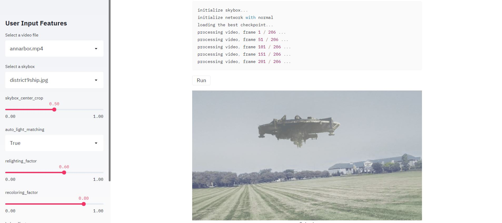

# SkyAR-StreamLit-Enabled

In this repository, you'll run the streamlit app on your local computer through a web browser. Follow the instructions below.


## Instructions

Checkout all the necessary requirements and steps to run the app below.

#### Requirements

Checkout [Requirements.txt](./Requirements.txt) file.

#### Steps to run

1) Clone this repo.

```
git clone https://github.com/AdityaNikhil/SkyAR-Streamlit-Enabled
cd SkyAR-Streamlit-Enabled
```

2) Download the pretrained sky matting model from [Google Drive](https://drive.google.com/file/d/1COMROzwR4R_7mym6DL9LXhHQlJmJaV0J/view?usp=sharing), and unzip into the repo directory.

```
unzip checkpoints_G_coord_resnet50.zip
```

## Producing results on streamlit

1) Open your console and type `streamlit run app.py` .


2) Choose your video file and a skybox and configure other settings or leave them to default and hit run.



## Conclusion

Thank you for trying out the app. Feel free to raise an issue if there's any problem running the app.

